# Traffic Sign Classifier

[](http://www.udacity.com/drive)


## Overview

The goal of this project is to build a prediction model that classifies [German Traffic Sign](https://benchmark.ini.rub.de/?section=gtsrb&subsection=dataset). This LeNet-5 based model reached a test accuracy of 0.934.

This model can decode traffic signs from natural images by using the German Traffic Sign Dataset. At the very last, I've tested my model program on new images of traffic signs found on the web.

---

## Data Set Summary & Exploration

### 1. A Basic Summary of the Data Set

I used simple numpy ndarray.shape and numpy.unique to analysis dataset. The given dataset was organized as follows.

```
Number of training examples = 12630
Number of validating examples =  4410
Number of testing examples = 34799
Image data shape = (32, 32, 3)
Number of classes = 43
```

### 2. Exploratory Visualization of the Dataset.

#### Initial Data Distribution
This bar graph shows the distribution of the given dataset for each class. As plotted in the graph, the initial data distribution was not well normalized. Some classes had dominating numbers of examples than others. I supposed that this could lead to overfitting to those classes, resulting lower prediction accuracy.

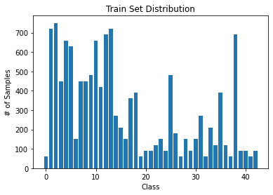

#### Data Augumentation
I oversampled classes that have only a few samples. Rather than simply duplicating the images, I applied zoom in, crop and brightness adjust for each copy. The parameters was randomly generated.

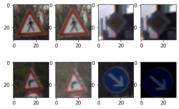

After augumentation, the data distribution is as described in graph. I've augumented all classes below twice the initial average. Also the total number of test set is increased to `26030` from `12630`.

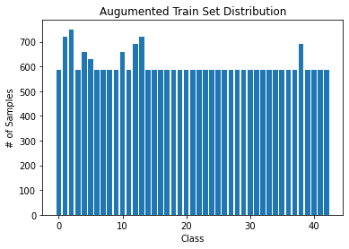


## Design and Test a Model Architecture

### 1. Preprocessing Images

The LeNet was originally designed for grayscale image. However, rather than converting each images to grayscale, I've modified the LeNet to accept 3 channels feature map as input. The color image has more data than grayscale. While driving in real world, the color of traffic sign is significant for identifying and each is designed with purpose.

Each channel of image were normalized to values between -1 and 1, centered at 0.

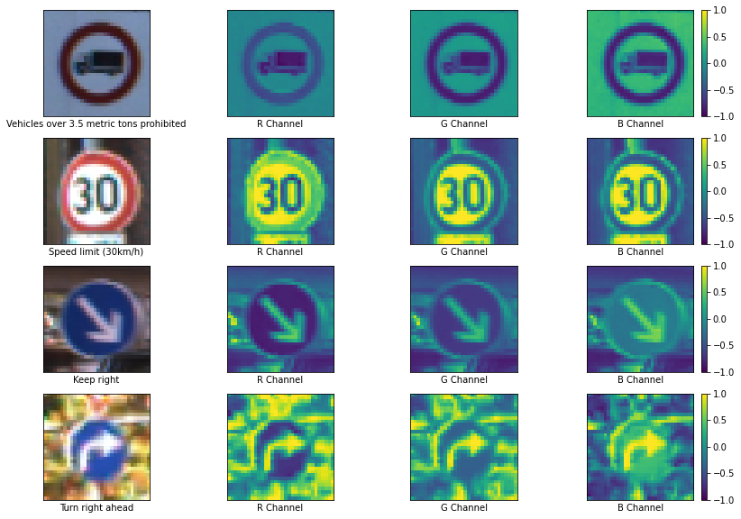


### 2. Model Architecture

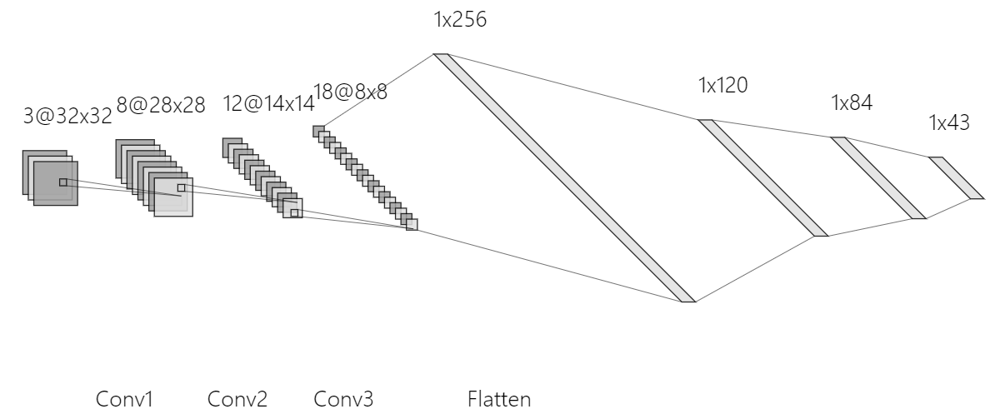

The model was modified a bit. I added a convolution layer and a dense layer each and enlarged the height of feature map for convolution layers. The traffic sign has more complex shape and features than MNIST data.

The LeNet is simple and efficient, but I supposed that it will perform better with larger and deeper network as the data is more complex and contains more data(like color). Moreover, I attached 4 drops layers and removed pooling and initialized the model weights with **He** initialization.

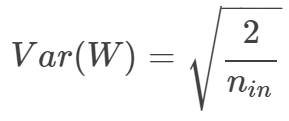

- More convolution and dense layers
- Increased feature map depth for convolution layers
- Dropout layers
- He initialization
- ReLU activation

My final model consisted of the following layers:

| Layer         		|     Description	        					| 
|:---------------------:|:---------------------------------------------:| 
| Input         		| 32x32x3 RGB image   							| 
| Convolution 3x3     	| 1x1 stride, vaild padding, outputs 28x28x8 	|
| Convolution 3x3     	| 2x2 stride, valid padding, outputs 14x14x12   |
| Dropout               |                                               |
| Convolution 3x3	    | 1x1 stride, valid padding, outputs 8x8x18		|
| Dropout               |                                               |
| Dense         		| outputs 256       							|
| Dropout               |                                               |
| Dense 				| output 120   									|
| Dropout				|												|
| Dense         		| output 84										|
| Dense                 | output 43                                     |
| Output                | logits for 43 classes                         |


### 3. Training the Model
Hyperparameters that I considered were:
| Hyperparameters           | Final Value        | 
|:-------------------------:|:-------------------:| 
| Learning Rate             | 0.00095             | 
| Batch Size            	| 128                 |
| Epoch                     | 100                 |
| Dropout Keep Probability	| 0.6                 |
| Model Architecture        | See above and below |

The optimizer used on this training is Adam. Adam performed generally better than SGD by rule of thumb.

### 4. Approach on Training
At the first time of training, with fresh LeNet, the validation accuracy was around `77%` ~ `83%`. Then I augumented by training set and modified LeNet a little larger, and reached around 87%. Then I started hundreds of experiments.

The batch size affected the accuracy significantly. With large batch(>200) the accuracy descreased drastically. Possible hypothesis is that it performs less gradient descents per epoch with large batch size. My optimal value was `128`

Learning rate was best around `0.001`. The accuracy dropped near `0.0001` and `0.01`. After repeated training, the optimal value was `0.00095`. The accuracy difference between `1` ~ `0.00095` was less than `1%`.

Epochs after 10 were only slight changes on accuracy, but still, there surely was very small increase of accuracy. The accuracy kept oscillating because of dropout.

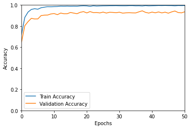

The dropout increase the validation accuracy drastically almost from `87%` to nearly `92%`. For training accuracy, there was no big change. This was really important for improving performance and made the model very **robust**. 

My final model results were:
* validation set accuracy of `93.5%`
* test set accuracy of __`93.4%`__

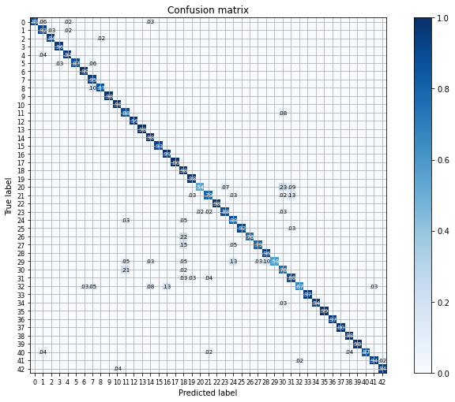


## Test a Model on New Images

### 1. Five German Traffic Signs Found on the Web

Here are five German traffic signs that I found on the web:
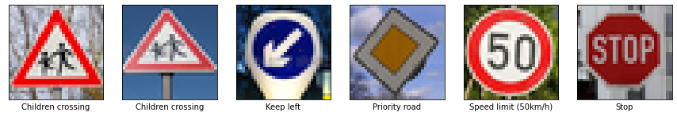

The second image might be difficult to classify as it's seen from below and the portrait is blurred a bit.

### 2. Model's Prediction on New Images
Accuracy on web image is `83.3%`. It's lower than the test accuracy, but we need more samples to compare these correctly.

Here are the results of the prediction:
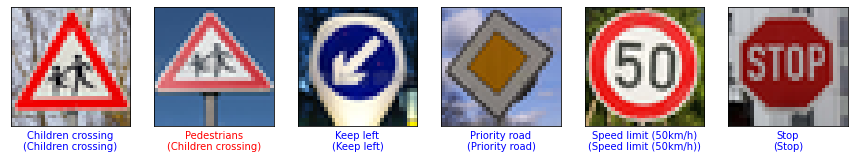

My model failed to predict the second model. It really looks like german pedestrian sign also in human eyes when it's blurred.

### 3. Top 5 Softmax Probabilites on New Images
Here are the softmax probabilites for each image:
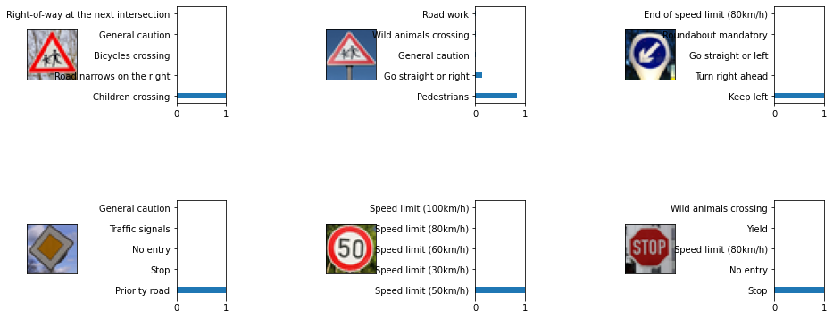

The model is very deterministic to 5 correct images, while being slightly confused about wrong one.

The code for making predictions on my final model is located at the end cell of the Ipython notebook. It runs `tf.math.top_k()` and `tf.nn.softmax()` with logits as parameter
